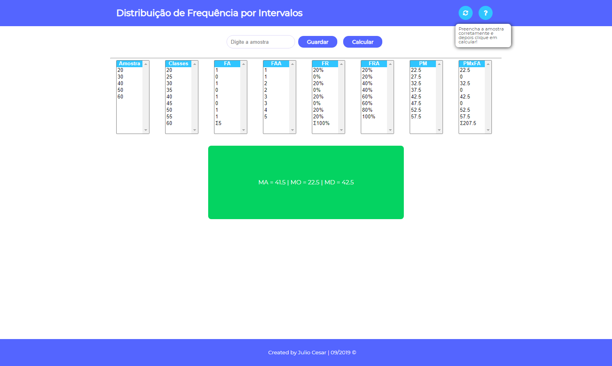
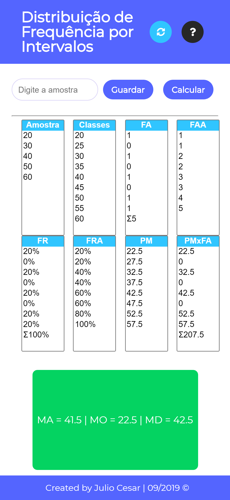

## Distribuição de Frequência Por Intervalos

**Realiza os Cálculos de Média Aritmética, Mediana e Modal como base em uma amostra de números.**

*Intuíto desse projeto é auxiliar na correção de exercicios de Estatística.*

